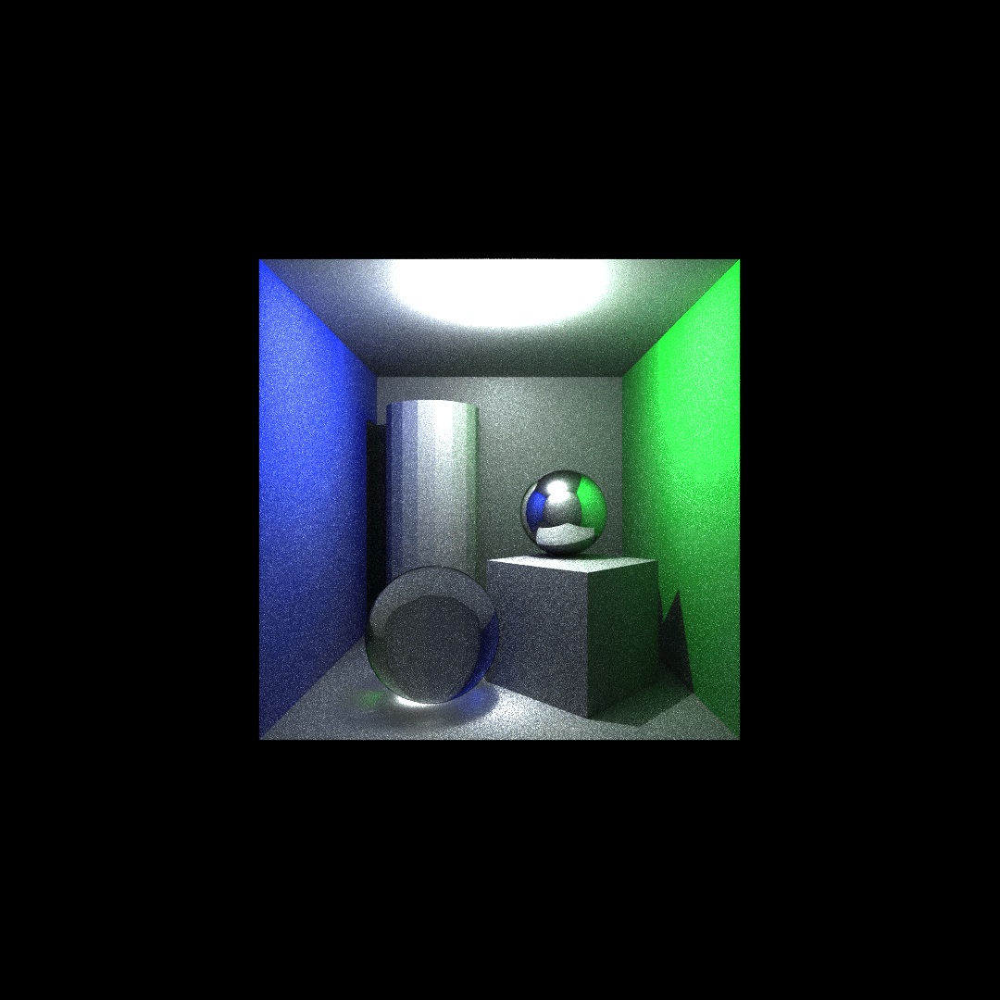

# CPU Ray tracer developed during Chaos Camp.
Final State of Renderer during Part 1 of Chaos Camp  at 28th of July 2025 is in the Branch titled: FinalProject

## Examples:

## Features:
- Whitted Style Ray tracing
- Diffuse Monte Carlo Ray tracing
- Multithreading
- a Kd-tree based Bounding Volume Hierarchy to accelerate Ray-Scene Intersection tests
- Deterministic reflections/refractions
- Procedural and Bitmap Texture Sampling
- loading .crtscene files

## Features to come:
- a Qt based UI (under development)
- loading .obj files
- Environment mapping
- PBR capable Material system
  
##Dependencies:
- stbi_load.h
- rapidjson.h
- Qt 6 (for Qt_Integration Branch)

